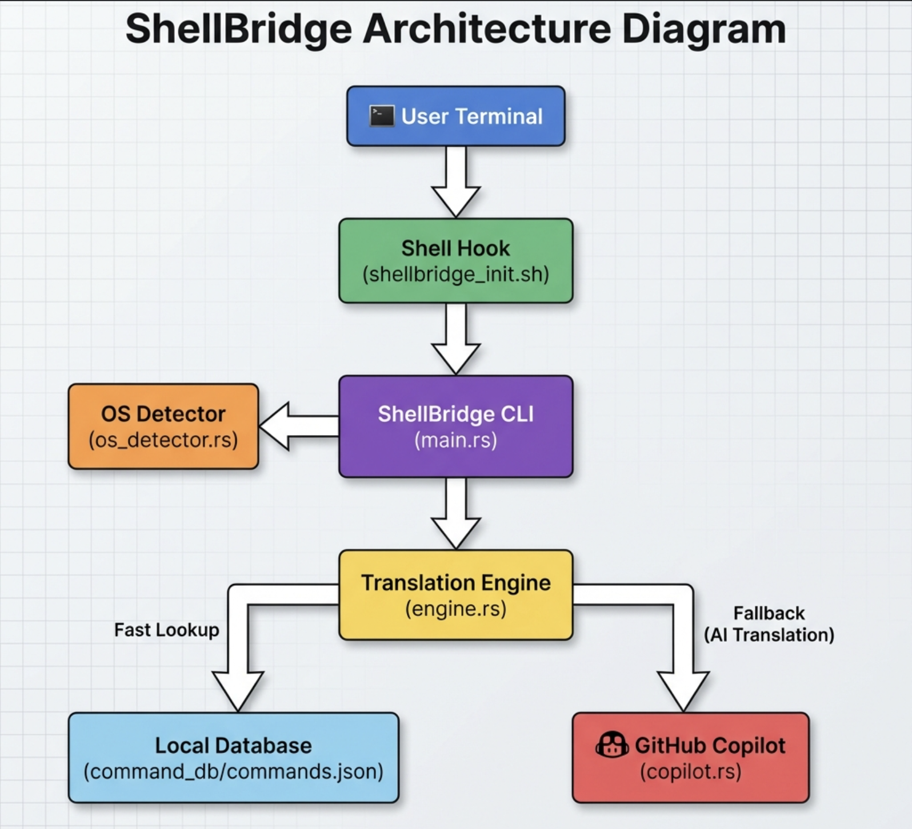

# ShellBridge

> **Powered by GitHub Copilot CLI** - Your intelligent companion for cross-platform shell commands


[](https://opensource.org/licenses/MIT)

ShellBridge is an intelligent CLI tool that leverages **GitHub Copilot CLI** to bridge the gap between different operating system shells. It translates shell commands seamlessly between Linux, macOS, and Windows, allowing developers to work across environments without memorizing platform-specific syntax.

## 💡 Why ShellBridge?

Every developer has been there:
- 📋 **Copy a command from Stack Overflow**... but it's for Linux and you're on Windows
- 🔄 **Switching between Mac at home** and Linux servers at work
- 📚 **Following tutorials** written for a different OS
- 🤝 **Collaborating with teams** using different platforms
- ⏰ **Wasting time** looking up equivalent commands across systems

**ShellBridge eliminates this friction**, letting you focus on solving problems instead of memorizing platform-specific syntax.

## 🤖 Powered by GitHub Copilot CLI

ShellBridge harnesses the intelligence of **GitHub Copilot CLI** to provide context-aware, accurate command translations. This isn't just simple string replacement—Copilot understands what you're trying to accomplish and generates the most appropriate cross-platform equivalent.

### How Copilot CLI Makes It Possible

- **🧠 Smart Context Understanding**: Copilot doesn't just do literal translation—it understands the intent behind your command
- **🎯 Handles Edge Cases**: For complex commands without direct equivalents, Copilot suggests idiomatic alternatives
- **📚 Vast Knowledge Base**: Benefits from Copilot's extensive training on shell commands across all major platforms
- **🔄 Pipe Intelligence**: Understands complex piped workflows and translates each component appropriately
- **💬 Natural Language**: Copilot bridges the gap between human intent and shell syntax

## 🚀 Features

- **🤖 AI-Powered Translation**: GitHub Copilot CLI intelligently translates commands between Linux, macOS, and Windows
- **⚡ Hybrid Intelligence**: Fast local lookups for common commands, Copilot CLI for complex queries
- **🔗 Piped Command Support**: Automatically splits and translates piped commands (e.g., `ip a | grep "127.0.0.1"`)
- **📖 Copilot-Enhanced Explanations**: Get AI-generated explanations for what commands do and why
- **🎯 Context-Aware**: Detects WSL, Docker, and GitBash environments; corrects path separators and environment variables
- **✨ Auto-Correction**: Shell integration suggests translations for unknown commands directly in your terminal
- **⚙️ Safe Execution**: Preview and execute translated commands with confidence
- **🔍 OS Detection**: Automatically detects your current operating system

<div align="center">
  
</div>


## See It In Action

### Example 1: Network Troubleshooting Across Platforms

**Scenario**: You're following a Linux tutorial on macOS

```bash
# The tutorial says:
ip addr show | grep inet

# ShellBridge translates it instantly using Copilot CLI:
$ shellbridge translate "ip addr show | grep inet" --target macos

✨ Translated by GitHub Copilot CLI:
ifconfig | grep inet

# Want to understand what it does?
$ shellbridge explain "ifconfig | grep inet"

📚 Copilot explains:
Lists all network interfaces and filters output to show only lines containing 
IP addresses (both IPv4 and IPv6). The 'inet' keyword matches address lines.
```

### Example 2: Package Management Translation

```bash
# Linux command from documentation:
$ shellbridge translate "sudo apt update && sudo apt install nginx" --target macos

✨ Translated by GitHub Copilot CLI:
brew update && brew install nginx

# What about Windows?
$ shellbridge translate "sudo apt install nginx" --target windows

✨ Translated by GitHub Copilot CLI:
choco install nginx
# Or alternatively: winget install nginx
```

### Example 3: Complex Piped Commands

```bash
# Original Windows PowerShell command:
$ shellbridge translate "Get-Process | Sort-Object CPU -Descending | Select-Object -First 10" --target linux

✨ Translated by GitHub Copilot CLI:
ps aux | sort -k3 -rn | head -10

🤖 Copilot understands:
- Get-Process → ps aux
- Sort-Object CPU → sort -k3 (CPU is 3rd column)
- -Descending → -rn (reverse numeric)
- Select-Object -First 10 → head -10
```

### Example 4: Auto-Correction in Your Shell

```bash
# On macOS, you accidentally type a Linux command:
$ ip addr show
zsh: command not found: ip

💡 ShellBridge suggests:
Did you mean: ifconfig
Run it? [y/N] y

# Executes the correct command automatically!
```

## 🛠️ Installation

### Prerequisites

1. **Rust Toolchain**: Ensure you have Rust and Cargo installed
   ```bash
   curl --proto '=https' --tlsv1.2 -sSf https://sh.rustup.rs | sh
   ```
   Or visit [Install Rust](https://www.rust-lang.org/tools/install)

2. **GitHub Copilot CLI**: Required for AI-powered translations
   ```bash
   # Install GitHub Copilot CLI
   gh extension install github/gh-copilot
   
   # Authenticate
   gh auth login
   ```

### Build from Source

```bash
git clone https://github.com/NikhilKottoli/ShellBridge.git
cd ShellBridge
cargo build --release
```

The binary will be available in `target/release/shellbridge`.

### Optional: Add to PATH

```bash
# Linux/macOS
sudo cp target/release/shellbridge /usr/local/bin/

# Or add to your PATH
export PATH="$PATH:/path/to/ShellBridge/target/release"
```
    
### Shell Integration (Recommended)

Enable automatic command correction by sourcing the setup script in your shell configuration.

```bash
# For Zsh (macOS default)
echo 'source /path/to/ShellBridge/shellbridge_init.sh' >> ~/.zshrc
source ~/.zshrc

# For Bash
echo 'source /path/to/ShellBridge/shellbridge_init.sh' >> ~/.bashrc
source ~/.bashrc
```

Now when you type an unknown command, ShellBridge automatically suggests the platform-appropriate alternative!

## 📖 Usage

### Basic Translation

Translate commands to your current OS or specify a target platform.

```bash
# Translate to current OS (auto-detected)
shellbridge translate "ip a"

# Translate to specific OS
shellbridge translate "ip a" --target macos
# Output: ifconfig

shellbridge translate "dir" --target linux
# Output: ls -la

shellbridge translate "ls -la" --target windows
# Output: Get-ChildItem
```

### Piped Commands

ShellBridge intelligently handles pipes, using Copilot CLI to translate each component.

```bash
shellbridge translate "ip a | grep 'inet'" --target macos
# Output: ifconfig | grep 'inet'

shellbridge translate "netstat -tuln | grep LISTEN" --target macos
# Output: lsof -nP -iTCP -sTCP:LISTEN
```

### Command Explanations

Let Copilot CLI explain what commands do and why you'd use them.

```bash
shellbridge explain "chmod 777"

📚 GitHub Copilot explains:
Sets read, write, and execute permissions for all users (owner, group, and others) 
on a file or directory. 

⚠️  Warning: This is generally considered insecure as it gives everyone full access. 
Consider using more restrictive permissions like 755 or 644.
```

```bash
shellbridge explain "awk '{print \$2}'"

📚 GitHub Copilot explains:
The awk command processes text line by line. This specific command prints the 
second field (column) from each line, where fields are separated by whitespace 
by default. Commonly used for extracting specific columns from command output.
```

### Execute Translated Commands

Run translated commands immediately with the `--execute` (or `-e`) flag.

```bash
# Translate and execute in one step
shellbridge translate "ls -la" --execute

# Preview before execution
shellbridge translate "rm -rf temp/" --target windows
# Output: Remove-Item -Recurse -Force temp/
# Execute? [y/N]
```

### Cross-Platform Workflows

```bash
# You're on macOS, following Windows documentation
shellbridge translate "ipconfig /all" --target macos
# Output: ifconfig -a

# You're on Linux, following macOS guide
shellbridge translate "brew services start nginx" --target linux
# Output: sudo systemctl start nginx

# Windows user following Linux tutorial
shellbridge translate "sudo systemctl status docker" --target windows
# Output: Get-Service docker
```

## 🏗️ Architecture
```
User Command
     ↓
┌─────────────────────────────────────┐
│  1. Fast Path: Local Database      │
│     • Instant lookup for common    │
│       commands (ls, cd, pwd, etc.) │
│     • No network latency           │
└─────────────────────────────────────┘
     ↓ (if not found)
┌─────────────────────────────────────┐
│  2. Intelligent Path: Copilot CLI  │
│     • Complex command analysis     │
│     • Context-aware translation    │
│     • Handles edge cases           │
│     • Suggests best practices      │
└─────────────────────────────────────┘
     ↓ (for piped commands)
┌─────────────────────────────────────┐
│  3. Recursive Processing           │
│     • Splits pipes intelligently   │
│     • Translates each segment      │
│     • Reassembles with correct     │
│       platform syntax              │
└─────────────────────────────────────┘
```

### Key Components

- **Core Engine**: CLI parsing, OS detection, and command routing
- **Local Database**: JSON store of common command mappings (`data/commands.json`)
- **Copilot Integration**: Queries GitHub Copilot CLI for intelligent translation
- **Context Analyzer**: Detects execution environment (WSL, Docker, GitBash)
- **Shell Hook**: Provides real-time command suggestions in your terminal

## 📝 License

MIT License - see [LICENSE](LICENSE) file for details.